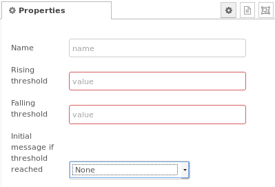

# node-red-contrib-edge-trigger
A set of nodes that trigger on edges:
- `rising edge`: Triggers on rising edge compared to a threshold value
- `falling edge`: Triggers on falling edge compared to a threshold value
- `hysteresis`: Triggers on both edges compared to two threshold values building a hysteresis band

  
**Fig. 1:** Node appearance

## Installation

### In Node-RED (preferred)
* Via Manage Palette -> Search for "node-red-contrib-edge-trigger"

### In a shell
* go to the Node-RED installation folder, e.g.: `~/.node-red`
* run `npm install node-red-contrib-edge-trigger`

## Usage

### Node Configuration

  
**Fig. 2:** Node properties (example hysteresis node)

Node configuration is quite simple: In the case of the `rising edge` resp. `falling edge` node, you only have to set one threshold value, in case of the `hysteresis` node, you have to set two threshold values and the initial behaviour (*None*, *Rising*, *Falling*, *Any*).

### Input
Input data are numerical values which are compared against threshold values.
Any other input data types (e.g. string data types) are ignored (see examples: String "12 Monkeys").

### Output

The nodes compare the numerical value of the incoming `msg.payload` to the value of the previous message. If that value has crossed a specified threshold (given in the *node configuration*) in a specified direction (*rising*, *falling*), the message is forwarded to the nodes output.

#### Rising edge
Given a threshold value, the node `rising edge` will forward its incoming `msg` if the numerical value of its `msg.payload` has increased above the threshold. An example applications is switching on a cooler when a temperature value rises.  

**Fig. 3:** `rising edge` incoming and outgoing messages

#### Falling edge
Given a threshold value, the node `falling edge` will forward its incoming `msg` if the numerical value of its `msg.payload` has dropped below the threshold. An example applications is switching on a heater when a temperature value drops.  

**Fig. 4:** `falling edge` incoming and outgoing messages

#### Hysteresis
The node `hysteresis`combines the functions of the `falling edge` and `rising edge` nodes. It has both rising and falling thresholds, and forwards the incoming `msg` if its numerical value of its `msg.payload` crosses either threshold in the appropriate direction. The outgoing message has its `edge` property set to `rising` or `falling` (see [example 2](#hysteresis_example2) below for the edge property).  
The difference between the two threshold values is called *hysteresis band*.  

**Fig. 5:** `hysteresis` incoming and outgoing messages

The `hysteresis` node is useful in situations where it would not be desirable to toggle an output repeatedly on and off if a value hovers around a single threshold (e.g. caused by noise). For example, a light that is activated by a luminosity sensor: It may be appropriate to turn the light on when the sensor indicates less than 30 lux, but not to turn it off again until the sensor indicates more than 40 lux.

## Examples
***
**Remark**: Example flows are present in the examples subdirectory. In Node-RED they can be imported via the import function and then selecting *Examples* in the vertical tab menue.
***

### Example 1: Rising and falling edge nodes

This example shows the behaviour of the `rising edge`and `falling edge` nodes. You can click on the inject nodes to see which values are forwarded and displayed at the debug nodes crossing the different threshold levels.  

[**RisingEdgeFallingEdgeFlow.json**](examples/RisingEdgeFallingEdgeFlow.json)  

**Fig. 6:** `rising edge` and `falling edge` example

### Example 2: Hysteresis node

This example shows the behaviour of the `hysteresis` node.
The example flow looks like this:  

[**HysteresisFlow.json**](examples/HysteresisFlow.json)  

**Fig. 7:** `hysteresis` node example

#### Example 2 node configuration
The two hysteresis values are 6371 and 40074. The node configuration is shown in the following figure.  

**Fig. 8:** `hysteresis` example node configuration

#### Example 2 property `msg.edge` output
An output of the nodes `msg.edge` property is shown in the following figure. When going below the lower hysteresis value (6371 in this example), the output shows:  

**Fig. 9:** `hysteresis`  node `msg.edge` property
